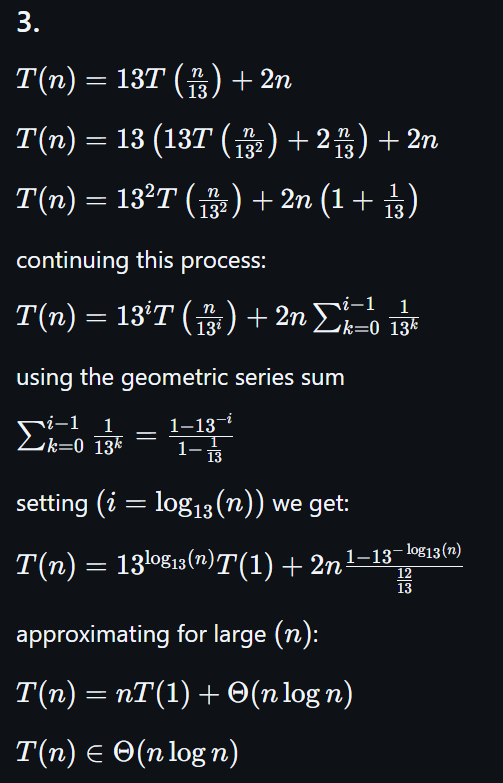

# Recurrent Recurrences

Give big $\Theta$ bounds for the following recurrence relations.

1.
$$ T(n) =
    \begin{cases}
        1 & n \leq 1\\
        T\left(\frac{n}{13}\right) + 5 & n > 1
    \end{cases}
$$

2.
$$ T(n) =
    \begin{cases}
        1 & n \leq 1\\
        13 T\left(\frac{n}{13}\right) + 5 & n > 1
    \end{cases}
$$

3.
$$ T(n) =
    \begin{cases}
        1 & n \leq 1\\
        13 T\left(\frac{n}{13}\right) + 2n & n > 1
    \end{cases}
$$

My work (done on paper) if you need me to redo it in LaTeX ill try and figure it out:

Answers in text:
1. O(log(n))
2. O(nlog(n))
3. O(nlog(n))

I certify that I have listed all sources used to complete this exercise, including the use of any Large Language Models. All of the work is my own, except where stated otherwise. I am aware that plagiarism carries severe penalties and that if plagiarism is suspected, charges may be filed against me without prior notice.